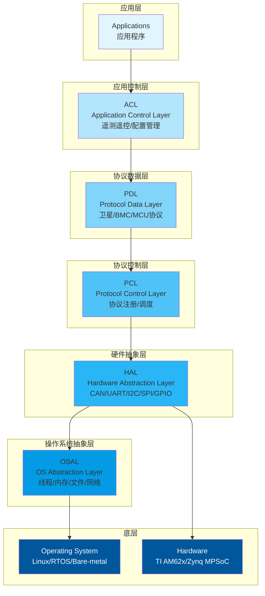
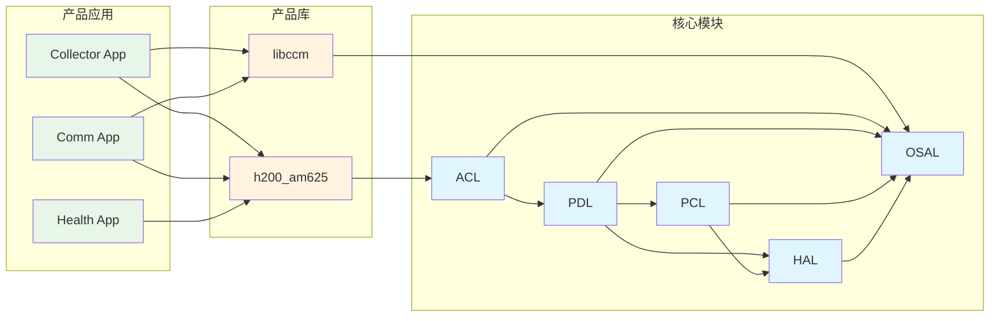
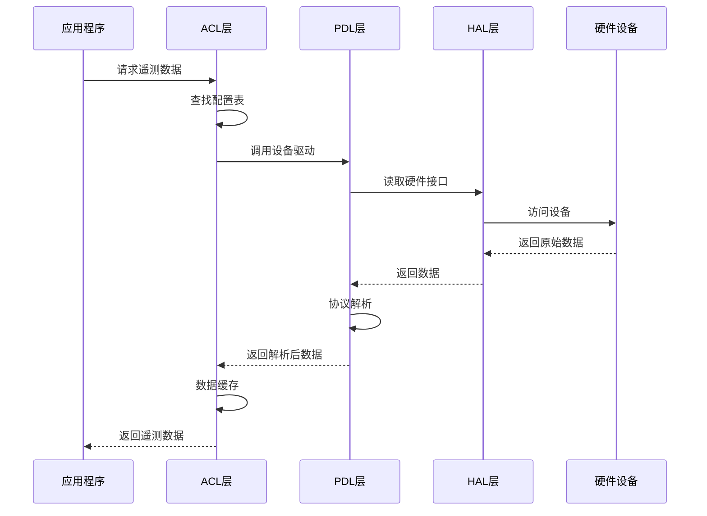
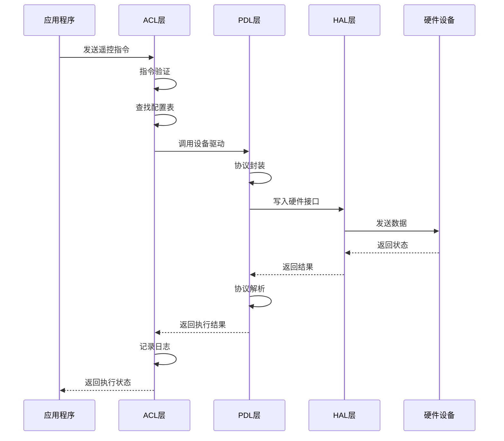
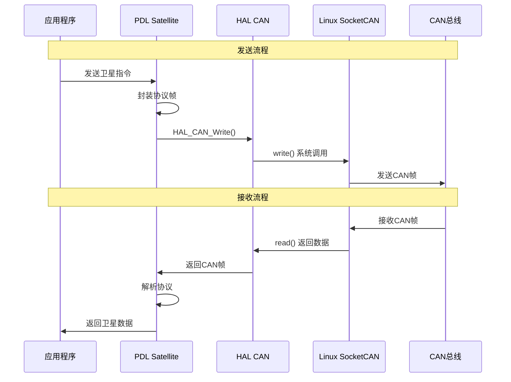
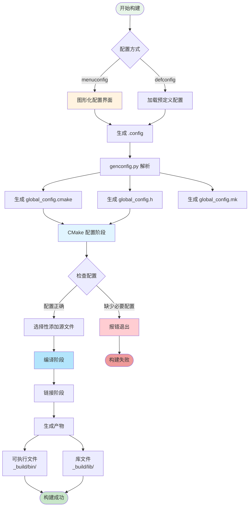
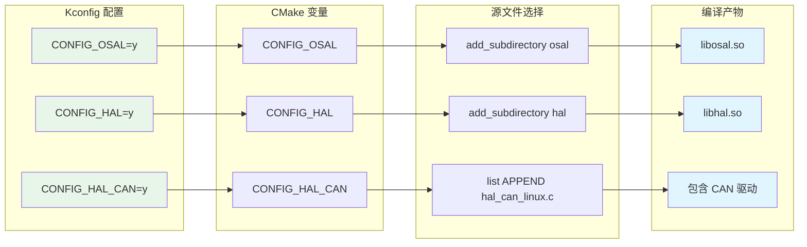
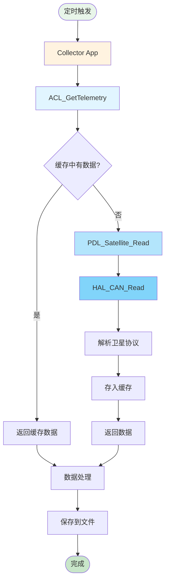
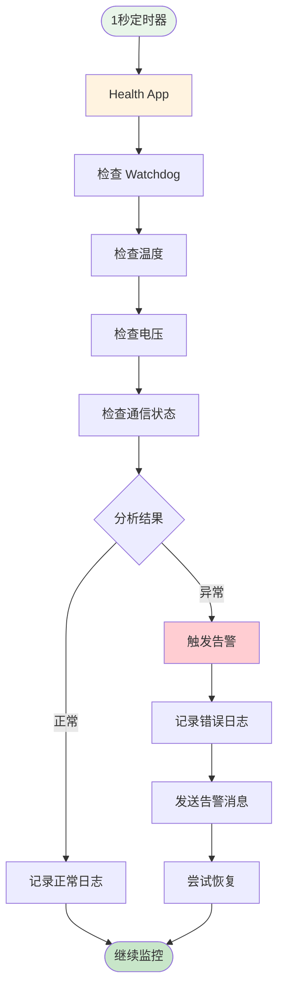

# EMS 架构概述

本文档详细介绍 EMS SDK 的系统架构、模块设计和依赖关系。

---

## 📊 系统架构

EMS 采用分层架构设计，从下到上分为 5 层：



### 架构特点

- **分层清晰**: 每层职责明确，接口规范
- **向下依赖**: 上层依赖下层，下层不依赖上层
- **可移植性**: OSAL 和 HAL 屏蔽平台差异
- **可扩展性**: 易于添加新协议和新应用
- **可配置性**: Kconfig 灵活配置功能模块

## 核心模块

### OSAL（操作系统抽象层）

**职责**: 屏蔽不同操作系统的差异，提供统一的系统调用接口。

**功能**:
- 线程管理（创建、销毁、同步）
- 进程管理（创建、等待、信号）
- 内存管理（分配、释放、共享内存）
- 文件操作（打开、读写、关闭）
- 网络通信（Socket、TCP/UDP）
- 时间管理（时钟、定时器、延时）

**支持平台**:
- Linux (POSIX)
- Windows (Win32)
- RTOS (FreeRTOS, RT-Thread)
- Bare Metal

### HAL（硬件抽象层）

**职责**: 屏蔽不同硬件平台的差异，提供统一的硬件访问接口。

**功能**:
- CAN 总线（发送、接收、过滤）
- UART 串口（配置、读写、流控）
- I2C 总线（主从模式、10位地址）
- SPI 总线（主从模式、DMA）
- GPIO（输入输出、中断、防抖）
- Watchdog（启动、喂狗、超时）

**支持平台**:
- Generic Linux (SocketCAN, sysfs)
- TI AM62x
- Xilinx Zynq MPSoC

### PCL（协议控制层）

**职责**: 管理通信协议的注册、查找和调度。

**功能**:
- 协议注册（版本管理）
- 协议查找（按 ID 或名称）
- 协议调度（解析、处理、响应）
- 协议验证（CRC、校验和）

### PDL（协议数据层）

**职责**: 实现具体的通信协议和数据处理。

**功能**:
- Watchdog 协议（心跳、超时检测）
- Satellite 协议（卫星平台通信）
- BMC 协议（基板管理控制器）
- MCU 协议（微控制器通信）

### ACL（应用控制层）

**职责**: 提供应用级的控制和管理功能。

**功能**:
- 遥测数据管理（采集、缓存、上报）
- 遥控指令处理（解析、执行、响应）
- 配置管理（加载、保存、验证）
- 状态监控（健康检查、告警）

## 📦 模块依赖关系

### 依赖图



### 依赖规则

1. **单向依赖**: 只能从上到下依赖
2. **最小依赖**: 只依赖直接需要的模块
3. **传递依赖**: CMake 自动处理传递依赖
4. **循环检测**: 构建系统会检测循环依赖

### 依赖示例

```cmake
# 应用只需声明直接依赖
target_link_libraries(collector
    PRIVATE
        h200_am625  # 平台库
        ccm         # 产品库
)

# CMake 自动链接传递依赖：
# h200_am625 → acl → pdl → pcl → hal → osal
```

---

## 🔄 数据流程

### 遥测数据采集流程



### 遥控指令处理流程



### CAN 通信流程



---

## 依赖关系

```
Apps → ACL → PDL → PCL → HAL → OSAL
```

**规则**:
- 上层可以依赖下层
- 下层不能依赖上层
- 同层之间不能相互依赖

## 目录结构

```
EMS/
├── core/                   # 核心模块（可复用）
│   ├── osal/              # 操作系统抽象层
│   ├── hal/               # 硬件抽象层
│   ├── pcl/               # 协议控制层
│   ├── pdl/               # 协议数据层
│   └── acl/               # 应用控制层
├── products/              # 产品应用（特定产品）
│   └── ccm/              # CCM 产品
│       ├── apps/         # 应用程序
│       ├── libs/         # 产品库
│       └── h200_am625/   # 平台适配
├── tests/                 # 测试代码
│   ├── unit/             # 单元测试
│   ├── performance/      # 性能测试
│   ├── stress/           # 压力测试
│   └── system/           # 系统测试
├── configs/               # 配置文件
├── scripts/               # 构建脚本
└── docs/                  # 文档
```

## 构建系统

EMS 使用非递归 Make 构建系统：

- **顶层 Makefile**: 控制整体构建流程
- **module.mk**: 各模块的构建配置
- **scripts/rules.mk**: 通用构建规则
- **scripts/functions.mk**: 辅助函数
- **Kconfig**: 配置管理系统

## 配置系统

使用 Kconfig 实现灵活的模块裁剪：

- 按需启用/禁用模块
- 选择静态库或动态库
- 配置平台参数（架构、OS、工具链）
- 调整优化级别和调试选项

## 应用程序

### CCM 产品应用

- **ccm_collector**: 数据采集服务
- **ccm_health**: 健康监控服务
- **ccm_logger**: 日志记录服务
- **ccm_supervisor**: 监控管理服务
- **ccm_comm**: 通信管理服务

### 运行模式

- **独立运行**: 每个应用独立进程
- **协同工作**: 通过 IPC 通信（共享内存、消息队列）
- **统一管理**: supervisor 负责启动、监控、重启

## 扩展性

### 添加新平台

1. 在 `core/hal/src/` 下创建平台目录
2. 实现 HAL 接口
3. 在 `core/hal/Kconfig` 中添加配置选项
4. 在 `core/hal/module.mk` 中添加源文件

### 添加新协议

1. 在 `core/pdl/src/` 下创建协议目录
2. 实现协议接口
3. 在 `core/pdl/Kconfig` 中添加配置选项
4. 在 `core/pdl/module.mk` 中添加源文件

### 添加新应用

1. 在 `products/ccm/apps/` 下创建应用目录
2. 创建 `module.mk` 文件
3. 在 `products/ccm/Kconfig` 中添加配置选项
4. 在顶层 `Makefile` 中包含 `module.mk`

## 性能考虑

- **零拷贝**: 使用共享内存减少数据拷贝
- **异步 I/O**: 使用 epoll/select 实现高并发
- **内存池**: 预分配内存减少动态分配开销
- **缓存优化**: 数据结构对齐，提高缓存命中率

## 可靠性设计

- **错误处理**: 统一的错误码和错误处理机制
- **资源管理**: 严格的资源申请和释放
- **看门狗**: 防止进程死锁或崩溃
- **日志记录**: 完整的日志系统用于故障诊断

---

## 🔨 构建流程

### Kconfig + CMake 构建流程



### 配置到编译的映射



---

## 🎯 典型应用场景

### 场景 1: 卫星数据采集



### 场景 2: 健康监控



---

## 📐 设计原则

### 1. 分层原则

- **职责分离**: 每层只负责特定功能
- **接口清晰**: 层与层之间通过明确的 API 交互
- **向下依赖**: 只能依赖下层，不能依赖上层

### 2. 模块化原则

- **高内聚**: 模块内部功能紧密相关
- **低耦合**: 模块之间依赖最小化
- **可替换**: 同层模块可以独立替换

### 3. 可配置原则

- **功能裁剪**: 通过 Kconfig 灵活配置
- **平台适配**: 支持多种操作系统和硬件平台
- **参数化**: 关键参数可配置

### 4. 可扩展原则

- **插件机制**: 易于添加新的协议和驱动
- **注册机制**: 动态注册和查找
- **回调机制**: 支持事件驱动

---

## 🔍 关键设计模式

### 1. 抽象工厂模式 (OSAL/HAL)

```c
// 统一接口，多平台实现
void* HAL_CAN_Open(const char *device, const hal_can_config_t *config);

// Linux 实现
void* HAL_CAN_Open_Linux(...);

// RTOS 实现
void* HAL_CAN_Open_RTOS(...);
```

### 2. 注册表模式 (PCL)

```c
// 协议注册
PCL_RegisterProtocol(protocol_id, handler);

// 协议查找
handler = PCL_FindProtocol(protocol_id);

// 协议调用
handler(data, len);
```

### 3. 观察者模式 (事件通知)

```c
// 注册回调
ACL_RegisterCallback(event_type, callback);

// 触发事件
ACL_NotifyEvent(event_type, data);
```

### 4. 单例模式 (全局管理器)

```c
// 获取全局实例
acl_manager_t* ACL_GetManager(void);
```

---

## 📚 扩展阅读

- [新手入门教程](GETTING_STARTED.md) - 快速上手
- [开发者指南](DEVELOPER_GUIDE.md) - 添加新功能
- [构建指南](CMAKE_BUILD_GUIDE.md) - 构建系统详解
- [配置指南](CONFIGURATION.md) - Kconfig 配置
- [编码规范](CODING_STANDARDS.md) - 代码风格

---

**更新时间**: 2026-05-28  
**版本**: 1.0.0
