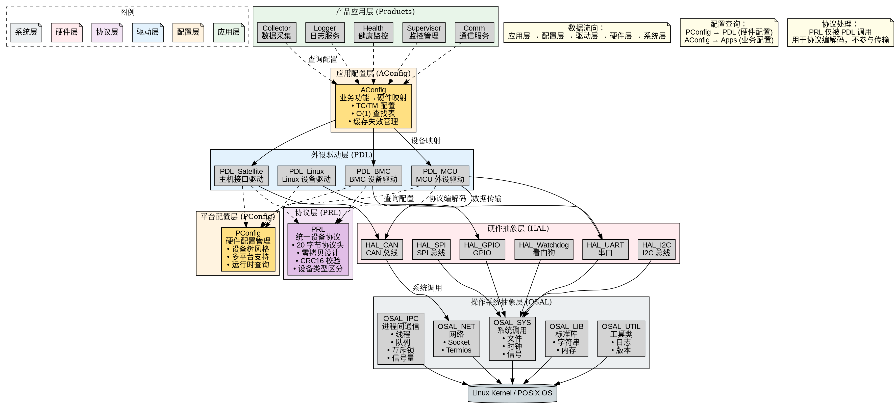
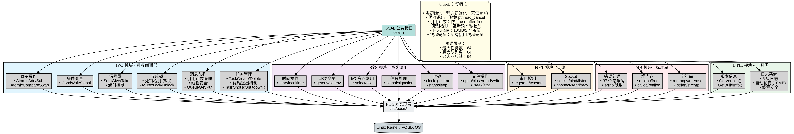
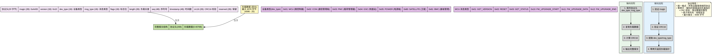
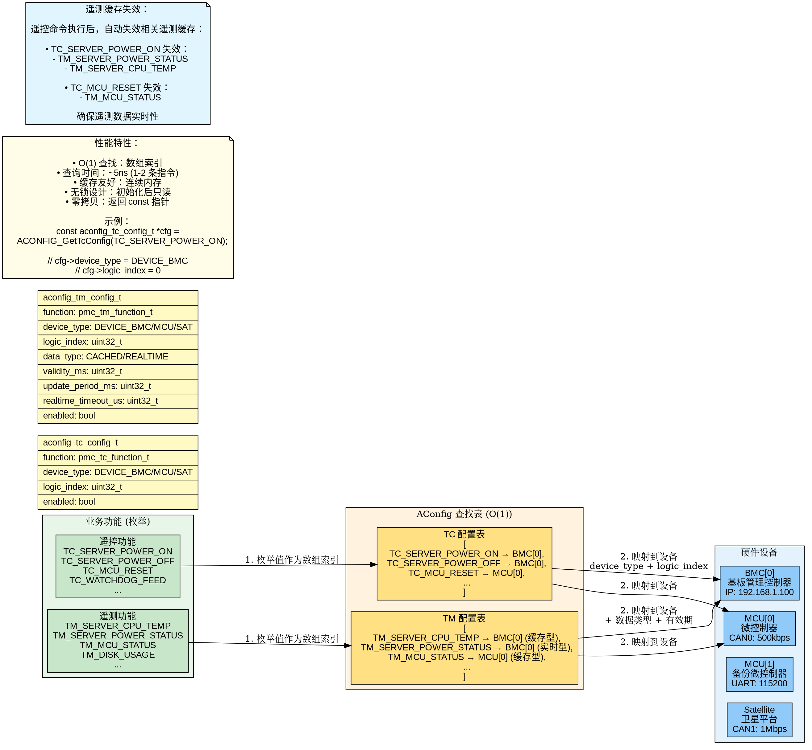
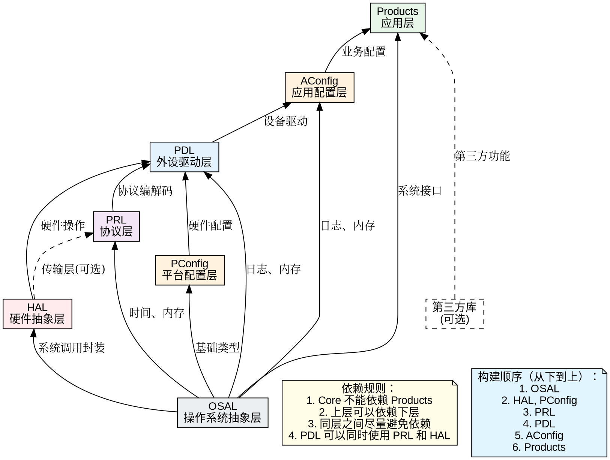
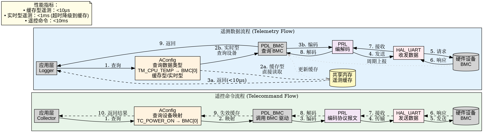
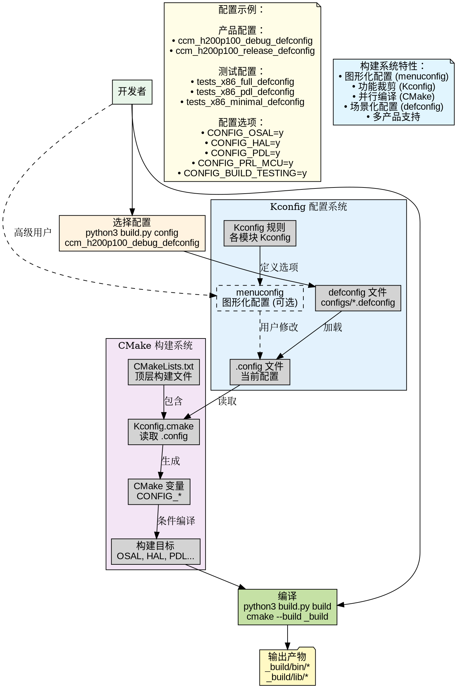

# ES-Middleware 系统架构文档

## 概述

ES-Middleware (Embedded Software - Middleware) 是一个面向航空航天嵌入式系统的软件框架，采用分层架构设计，支持多平台、多产品配置。

本文档提供系统整体架构的完整视图，包括模块层次、依赖关系、数据流向和关键设计决策。

## 架构总览



ES-Middleware 采用经典的分层架构，从下到上依次为：

1. **OSAL** - 操作系统抽象层
2. **HAL** - 硬件抽象层
3. **PConfig & PRL** - 平台配置层和协议层（独立模块）
4. **PDL** - 外设驱动层
5. **AConfig** - 应用配置层
6. **Products** - 产品应用层

### 架构原则

- **单向依赖**：上层依赖下层，下层不依赖上层
- **Core 独立**：Core 模块不依赖 Products
- **平台无关**：配置层和协议层保持平台无关
- **接口抽象**：通过抽象接口隔离实现细节

## 核心模块详解

### 1. OSAL (操作系统抽象层)

**职责**：提供跨平台的操作系统接口，隔离 Linux/RTOS 差异。

**主要功能**：
- **IPC**：线程、消息队列、互斥锁、信号量、条件变量、原子操作
- **SYS**：文件、时钟、信号、Select、环境变量、时间
- **NET**：Socket、Termios（串口控制）
- **LIB**：字符串、堆内存、错误处理
- **UTIL**：日志系统、版本信息

**关键特性**：
- 零初始化设计（静态初始化）
- 优雅退出机制（避免 pthread_cancel）
- 引用计数（消息队列）
- 死锁检测（互斥锁 5 秒超时）
- 日志轮转（10MB/5 个备份）

**内存占用**：~5KB (最小) ~ 50KB (完整)



**详细文档**：
- [OSAL README](../core/osal/README.md)
- [OSAL 使用指南](../core/osal/docs/USAGE_GUIDE.md)

---

### 2. HAL (硬件抽象层)

**职责**：封装硬件驱动，提供统一的硬件访问接口。

**支持的硬件**：
- **CAN 总线**：基于 SocketCAN，支持标准帧/扩展帧
- **串口 (UART)**：基于 termios，支持 9600-4000000 波特率
- **I2C 总线**：基于 i2c-dev，支持 7/10 位地址
- **SPI 总线**：基于 spidev，支持 MODE 0-3
- **GPIO**：数字 I/O 控制
- **Watchdog**：看门狗服务

**设计特点**：
- 平台隔离（`src/linux/`、`src/rtems/` 等）
- 统一接口（所有平台实现相同 API）
- 必须使用 OSAL 封装的系统调用

**内存占用**：~5KB (单驱动) ~ 50KB (全驱动)

**详细文档**：
- [HAL README](../core/hal/README.md)
- [HAL 架构设计](../core/hal/docs/ARCHITECTURE.md)
- [HAL API 参考](../core/hal/docs/API_REFERENCE.md)

---

### 3. PConfig (平台配置层)

**职责**：管理硬件配置信息，类似 Linux 设备树。

**设计理念**：
- 以外设为单位组织配置
- 配置与代码分离
- 接口内嵌（每个外设配置包含其通信接口）
- 支持多平台、多版本

**配置目录结构**：
```
pconfig/platform/
├── ti/am6254/H200_100P/        # TI AM6254 平台
│   ├── h200_100p_base.c        # 基础配置
│   ├── h200_100p_v1.c          # V1 版本
│   └── h200_100p_v2.c          # V2 版本
└── vendor_demo/                 # 示例平台
```

**配置选择优先级**：
1. 环境变量 `PCONFIG_PLATFORM`（最高）
2. CMake 编译选项 `-DPCONFIG_PLATFORM`
3. 默认配置（最低）

**内存占用**：~10KB + 配置数据

**详细文档**：
- [PConfig README](../core/pconfig/README.md)
- [PConfig 架构设计](../core/pconfig/docs/ARCHITECTURE.md)

---

### 4. PRL (协议层)

**职责**：提供统一的设备通信协议，用于内部设备间通信。

**设计理念**：
- 统一协议格式（所有设备使用相同协议头）
- 设备类型区分（通过 `dev_type` 字段）
- 零拷贝设计（解码时直接返回指针）
- CRC16 校验保证数据完整性

**协议格式**（20 字节协议头）：
```c
typedef struct {
    uint16_t magic;         /* 0xAA55 */
    uint8_t  version;       /* 0x10 */
    uint8_t  dev_type;      /* 设备类型 */
    uint8_t  msg_type;      /* 消息类型 */
    uint8_t  flags;         /* 标志位 */
    uint16_t length;        /* 负载长度 */
    uint32_t seq;           /* 序列号 */
    uint32_t timestamp;     /* 时间戳 */
    uint16_t crc16;         /* CRC16 */
    uint16_t reserved;      /* 保留 */
} prl_header_t;
```

**支持的设备类型**：
- MCU (微控制器)
- CCM (通信管理板)
- PMC (载荷管理器)
- GSC (地面站控制器)
- POWER (电源板)

**使用方式**：
- PRL 仅被 PDL 调用
- 用于协议编解码，不参与数据传输
- PDL 通过 HAL 进行实际的数据收发

**内存占用**：~15KB + 协议缓冲区



**详细文档**：
- [PRL README](../core/prl/README.md)
- [PRL 架构设计](PRL_ARCHITECTURE.md)

---

### 5. PDL (外设驱动层)

**职责**：管理外部设备，提供高层外设驱动接口。

**设计理念**：
- 主控制器为核心，外部设备统一抽象为外设
- 完全平台无关，通过 HAL 访问硬件
- 使用 PConfig 查询硬件配置
- 使用 PRL 进行协议编解码

**支持的外设类型**：
- **MCU 外设**：微控制器通信
- **主机接口**：与卫星平台通信
- **BMC 设备**：基板管理控制器
- **Linux 设备**：运行操作系统的设备

**关键特性**：
- 多通道冗余（如 BMC 以太网+串口）
- 自动故障切换（5 次连续失败）
- 心跳机制（主机接口 5 秒心跳）

**内存占用**：~8KB (单模块) ~ 40KB (全模块)

**详细文档**：
- [PDL README](../core/pdl/README.md)
- [PDL 架构设计](../core/pdl/docs/ARCHITECTURE.md)
- [PDL API 参考](../core/pdl/docs/API_REFERENCE.md)

---

### 6. AConfig (应用配置层)

**职责**：连接业务逻辑和硬件实现，提供业务功能到硬件设备的映射。

**设计目标**：
- 业务与硬件解耦
- 配置驱动（修改配置适配不同硬件）
- O(1) 查询性能（数组直接索引）
- 类型安全（使用枚举而非字符串）

**核心概念**：
```
业务功能枚举 → AConfig 查找表 → 硬件设备
TC_POWER_ON  → [device_type, logic_index] → BMC[0]
```

**关键特性**：
- O(1) 查询（~5ns）
- 缓存友好（连续内存）
- 无锁设计（初始化后只读）
- 零拷贝（返回 const 指针）
- 遥测缓存失效管理

**内存占用**：~20KB + 配置表



**详细文档**：
- [AConfig README](../core/aconfig/README.md)

---

### 7. Products (产品应用层)

**职责**：实现具体产品的业务逻辑。

**当前产品**：
- **CCM** (通信管理板)：卫星载荷通信管理
  - `collector`：数据采集服务
  - `logger`：日志服务
  - `health`：健康监控服务
  - `supervisor`：监控管理服务
  - `comm`：通信服务

**设计特点**：
- 基于 Core 模块构建
- 通过 AConfig 查询配置
- 调用 PDL 进行设备操作

**详细文档**：
- [CCM README](../products/ccm/README.md)

## 模块依赖关系



### 依赖规则

1. **Core 不依赖 Products**：Core 模块保持独立，可在不同产品间复用
2. **上层依赖下层**：依赖关系单向，下层不依赖上层
3. **同层避免依赖**：同层模块之间尽量避免依赖
4. **特殊情况**：
   - PDL 可以同时使用 PRL（协议编解码）和 HAL（数据传输）
   - PConfig 和 PRL 是独立模块，互不依赖

### 构建顺序

从下到上依次构建：
1. OSAL
2. HAL、PConfig
3. PRL
4. PDL
5. AConfig
6. Products

## 数据流向



### 遥控命令流程

```
应用层 → AConfig (查询设备映射) → PDL (调用驱动) → 
PRL (编码协议) → HAL (发送数据) → 硬件设备
```

**典型场景**：服务器上电
1. `collector` 调用 `ACONFIG_GetTcConfig(TC_POWER_ON)`
2. AConfig 返回 `{device_type: BMC, logic_index: 0}`
3. 调用 `PDL_BMC_PowerOn(0)`
4. PDL 使用 `PRL_Encode()` 编码协议报文
5. PDL 调用 `HAL_UART_Send()` 发送数据
6. BMC 执行上电操作并响应
7. PDL 使用 `PRL_Decode()` 解码响应
8. AConfig 失效相关遥测缓存
9. 返回结果给应用层

**性能指标**：< 10ms

### 遥测数据流程

ES-Middleware 支持两种遥测数据类型：

**缓存型遥测**（高频访问）：
```
应用层 → AConfig (查询类型) → 共享内存 (直接读取) → 返回
```
- 性能：< 10μs
- 适用：CPU 温度、电压等高频查询数据
- 后台线程定期更新缓存

**实时型遥测**（低频、实时性要求高）：
```
应用层 → AConfig → PDL → PRL (编解码) → HAL (收发) → 硬件设备
```
- 性能：< 1ms（超时降级到缓存）
- 适用：电源状态、设备在线状态等

## 配置系统



ES-Middleware 使用 **Kconfig + CMake** 混合构建系统：

### Kconfig 配置

- **图形化配置**：`make menuconfig`
- **预定义配置**：`configs/*_defconfig`
- **当前配置**：`.config` 文件

### CMake 构建

- **读取配置**：`Kconfig.cmake` 读取 `.config`
- **生成变量**：转换为 `CONFIG_*` CMake 变量
- **条件编译**：根据配置选择性编译模块

### 配置类型

**产品配置**：
- `ccm_h200_100p_am625_debug_defconfig` - CCM 调试版本
- `ccm_h200_100p_am625_release_defconfig` - CCM 发布版本

**测试配置**：
- `tests_x86_full_defconfig` - 全栈测试
- `tests_x86_pdl_defconfig` - PDL 单元测试
- `tests_x86_minimal_defconfig` - 最小化配置

## 关键设计决策

### 1. 为什么 PRL 和 HAL 分离？

- **职责分离**：PRL 负责协议编解码，HAL 负责硬件传输
- **复用性**：PRL 可用于任何传输方式（CAN/UART/网络）
- **测试性**：可以独立测试协议正确性，无需实际硬件

### 2. 为什么需要 AConfig？

- **业务与硬件解耦**：业务代码不关心底层硬件细节
- **配置驱动**：换硬件只需修改配置，无需修改代码
- **性能优化**：O(1) 查找，适合实时系统

### 3. 为什么 PDL 直接调用 HAL？

- **数据传输路径**：PDL → HAL → 硬件
- **协议处理**：PDL 使用 PRL 进行编解码，但数据传输通过 HAL
- **清晰职责**：PRL 只负责协议，不参与传输

### 4. 为什么使用 Kconfig？

- **图形化配置**：直观的 menuconfig 界面
- **依赖管理**：自动处理配置依赖关系
- **功能裁剪**：根据需求定制功能，优化资源占用

## 性能指标

| 操作 | 延迟 | 说明 |
|------|------|------|
| AConfig 查询 | ~5ns | O(1) 数组索引 |
| 缓存型遥测 | < 10μs | 共享内存读取 |
| 实时型遥测 | < 1ms | 含协议编解码和硬件通信 |
| 遥控命令 | < 10ms | 完整请求-响应周期 |
| 任务切换 | < 1ms | OSAL 任务管理 |
| 队列操作 | < 100μs | OSAL 消息队列 |
| 互斥锁获取 | < 50μs | OSAL 互斥锁 |

## 内存占用

| 模块 | 最小 | 典型 | 完整 |
|------|------|------|------|
| OSAL | 5KB | 20KB | 50KB |
| HAL | 5KB | 20KB | 50KB |
| PConfig | 10KB | 15KB | 20KB |
| PRL | 15KB | 20KB | 30KB |
| PDL | 8KB | 20KB | 40KB |
| AConfig | 20KB | 25KB | 30KB |
| **总计** | **63KB** | **120KB** | **220KB** |

*注：不包括应用层和协议缓冲区*

## 扩展性

### 添加新硬件驱动

1. 在 `HAL` 添加驱动接口
2. 在 `PConfig` 添加硬件配置
3. 在 `PDL` 添加外设驱动（可选）

### 添加新设备协议

1. 在 `PRL` 添加设备类型和消息定义
2. 在 `PDL` 实现设备驱动
3. 在 `AConfig` 添加业务映射（可选）

### 添加新产品

1. 创建 `products/<product_name>/` 目录
2. 实现产品应用
3. 创建 `configs/<product>_defconfig` 配置
4. 编译和测试

## 相关文档

- [命名规范](NAMING_CONVENTIONS.md)
- [编码规范](CODING_STANDARDS.md)（待创建）
- [开发者指南](DEVELOPER_GUIDE.md)（待创建）
- [构建指南](CMAKE_BUILD_GUIDE.md)（待创建）

---

**最后更新**：2026-06-08  
**维护者**：wanguo  
**版本**：v1.0
